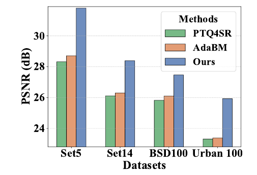
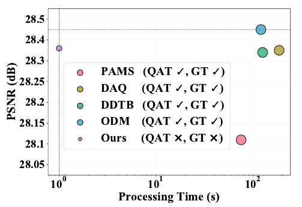
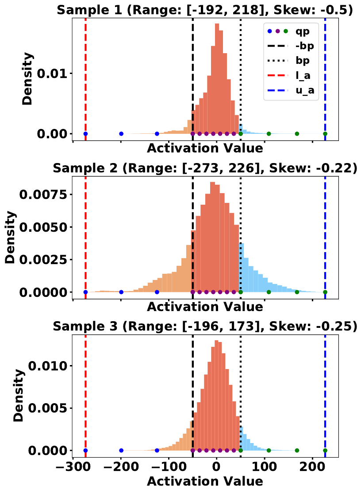
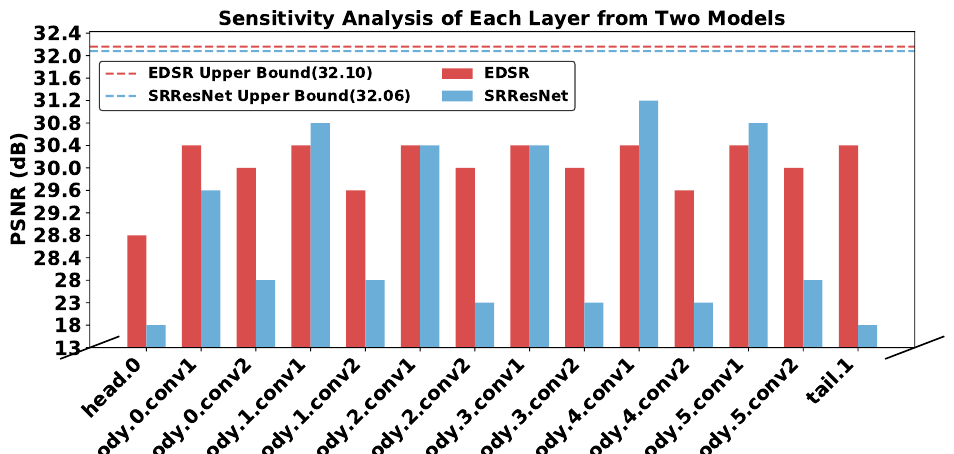

<div align="center">

# Outlier-Aware Post-Training Quantization for Image Super-Resolution

**[Hailing Wang](https://github.com/haiiling)**, Jianglin Lu, Yitian Zhang, Yun Fu

Northeastern University, USA

**ICCV 2025**

[](https://haiiling.github.io/OAQ-SR/)
[](https://arxiv.org/abs/2511.00682)
[](LICENSE)

 

</div>

---

## Overview

Post-training quantization (PTQ) is attractive for image super-resolution because it
needs no ground truth and no retraining — but existing PTQ methods for SR overlook
**activation outliers**, and that is exactly where the accuracy goes.

Our analysis shows two things:

1. **Outliers carry colour information.** Clipping just 1 % of the activation outliers
   in a full-precision SR model already produces visible colour shifts, so outliers
   must be *preserved*, not discarded.
2. **Layers differ in sensitivity.** Quantizing individual layers of EDSR/SRResNet to
   4 bit costs anywhere between 0.9 dB and 14 dB, so treating every layer equally
   wastes the optimization budget.

From these two observations we build a method with two components:

| Component | What it does |
| --- | --- |
| **Piecewise Linear Quantizer (PLQ)** | Splits the activation range at a breakpoint `bp` into a symmetric **dense region** `[-bp, bp]` and an **outlier region** `[l_a, -bp) ∪ (bp, u_a]`, and quantizes each region uniformly and independently. Outliers survive without eating the bit-width reserved for normal activations. |
| **Sensitivity-Aware Finetuning (SAFT)** | Weights the feature-matching loss of each layer by its measured quantization sensitivity, so calibration effort concentrates where quantization actually hurts. |

The result matches quantization-aware training on most settings while being **≥ 75×
faster** and requiring **no ground-truth HR images**.

<div align="center">

&nbsp;&nbsp;

</div>

## Results

PSNR (dB) at scale ×4, W4A4. Full tables — including W6A6, SSIM, Test2K/4K and the
comparison against QAT — are in the [paper](https://arxiv.org/abs/2511.00682) and on
the [project page](https://haiiling.github.io/OAQ-SR/).

| Model | Method | Set5 | Set14 | BSD100 | Urban100 |
| --- | --- | --- | --- | --- | --- |
| EDSR | MinMax | 26.83 | 25.04 | 24.57 | 23.12 |
| EDSR | PTQ4SR | 30.51 | 27.62 | 26.88 | 24.92 |
| EDSR | AdaBM | 31.02 | 27.87 | 26.91 | 25.11 |
| EDSR | **Ours** | **31.54** | **28.26** | **27.36** | **25.61** |
| RDN | MinMax | 25.91 | 24.22 | 24.29 | 22.24 |
| RDN | PTQ4SR | 28.32 | 26.11 | 25.82 | 23.31 |
| RDN | AdaBM | 28.71 | 26.30 | 26.10 | 23.38 |
| RDN | **Ours** | **31.80** | **28.39** | **27.47** | **25.93** |

Against QAT baselines on EDSR (W4A4), our method needs neither retraining nor ground
truth and still lands within 0.2 dB of the best QAT method, at **1× processing time
versus 75–185×**.

## Installation

```bash
conda env create -f environment.yaml
conda activate oaqsr
```

Or, on an existing PyTorch environment:

```bash
pip install -r requirements.txt
```

## Data

* **Calibration / training** — 100 LR images sampled from
  [DIV2K](https://cv.snu.ac.kr/research/EDSR/DIV2K.tar). No HR ground truth is used.
* **Evaluation** — the standard
  [benchmarks](https://cv.snu.ac.kr/research/EDSR/benchmark.tar) (Set5, Set14, BSD100,
  Urban100) and the large-input
  [Test2K/4K/8K](https://drive.google.com/drive/folders/18b3QKaDJdrd9y0KwtrWU2Vp9nHxvfTZH)
  sets built from DIV8K.

```
datasets
├── DIV2K
│   ├── DIV2K_train_LR_bicubic
│   ├── DIV2K_train_HR
│   ├── test2k
│   ├── test4k
│   └── test8k
└── benchmark
    ├── Set5
    ├── Set14
    ├── B100
    └── Urban100
```

Point `--dir_data` at this directory (default: `../datasets`).

## Pretrained full-precision models

Download the full-precision EDSR / RDN / SRResNet checkpoints from the
[AdaBM release](https://drive.google.com/drive/folders/1GLuvwy3WWFG2H6iEA6-7tqRj_Jnzcn86)
and place them in `pretrained_model/`:

```
pretrained_model
├── edsr_baseline_x4.pt
├── rdn_baseline_x4.pt
└── bnsrresnet_x4.pt
```

## Usage

All commands go through `scripts/run.sh <function> <gpu_id> <a_bit> <w_bit>`:

```bash
# Quantize EDSR to W4A4 (calibration + sensitivity-aware finetuning, ~75 s on a 2080Ti)
sh scripts/run.sh edsr 0 4 4

# Evaluate the quantized model on Set5 / Set14 / BSD100 / Urban100
sh scripts/run.sh edsr_eval 0 4 4

# Other networks and bit-widths
sh scripts/run.sh rdn      0 4 4
sh scripts/run.sh srresnet 0 6 6
sh scripts/run.sh edsr     0 6 6
```

Quantized checkpoints and logs are written to `experiment/<save-name>/`.

### Key options

| Flag | Meaning |
| --- | --- |
| `--quantize_a` / `--quantize_w` | activation / weight bit-width |
| `--bp_init` | how the breakpoint `bp` is initialised: `asym` (99th percentile, paper default), `norm`, `laplace`, `search`, `coarse2fine` |
| `--percentile_alpha` | the percentile used by `asym` (default `0.99`) |
| `--count_std` | measure the per-layer sensitivity `s_k` during calibration (Eq. 4) |
| `--saft` | weight the feature loss by `s_k` — sensitivity-aware finetuning (Eq. 6) |
| `--lambda_rec` | λ, weight of the reconstruction loss in Eq. 7 (default `5.0`) |
| `--ema_beta` | β for the EMA update of the quantization ranges (default `0.9`) |
| `--fq` | fully quantize the network (first / last layers at 8 bit) |
| `--test_own` | run on your own image directory instead of a benchmark |

### Ablation (Table 4)

```bash
sh scripts/run.sh edsr_plq_only 0 4 4   # PLQ + vanilla finetuning
sh scripts/run.sh edsr          0 4 4   # PLQ + SAFT (full method)
```

## Repository layout

```
src/
├── main.py                 entry point
├── option.py               command-line options
├── trainer.py              calibration + sensitivity-aware finetuning (Algorithm 1)
├── utility.py              logging, checkpointing, PSNR/SSIM
├── data/                   DIV2K, benchmark and Test2K/4K/8K loaders
└── model/
    ├── quantize.py         QConv2d + the piecewise linear quantizer (Eq. 1-3)
    ├── pwlq.py, uniform.py quantizer primitives
    ├── common.py           residual block, upsampler, feature collection
    └── edsr.py, rdn.py, srresnet.py
scripts/run.sh              all training / evaluation commands
tools/                      activation-distribution plots (Figures 2 and 3)
docs/                       project page (GitHub Pages)
```

## Reproducing the figures

```bash
cd src && python ../tools/plot_activation_distribution.py \
    --model EDSR --scale 4 --pre_train ../pretrained_model/edsr_baseline_x4.pt \
    --dir_data ../datasets --data_test Set5
```

## Citation

```bibtex
@inproceedings{wang2025outlier,
  title     = {Outlier-Aware Post-Training Quantization for Image Super-Resolution},
  author    = {Wang, Hailing and Lu, Jianglin and Zhang, Yitian and Fu, Yun},
  booktitle = {Proceedings of the IEEE/CVF International Conference on Computer Vision (ICCV)},
  year      = {2025}
}
```

## Acknowledgements

This implementation builds on [AdaBM](https://github.com/Cheeun/AdaBM) and
[EDSR-PyTorch](https://github.com/thstkdgus35/EDSR-PyTorch). We thank the
authors for releasing their code.

## Contact

Hailing Wang — [wang.haili@northeastern.edu](mailto:wang.haili@northeastern.edu)

## License

[MIT](LICENSE)
